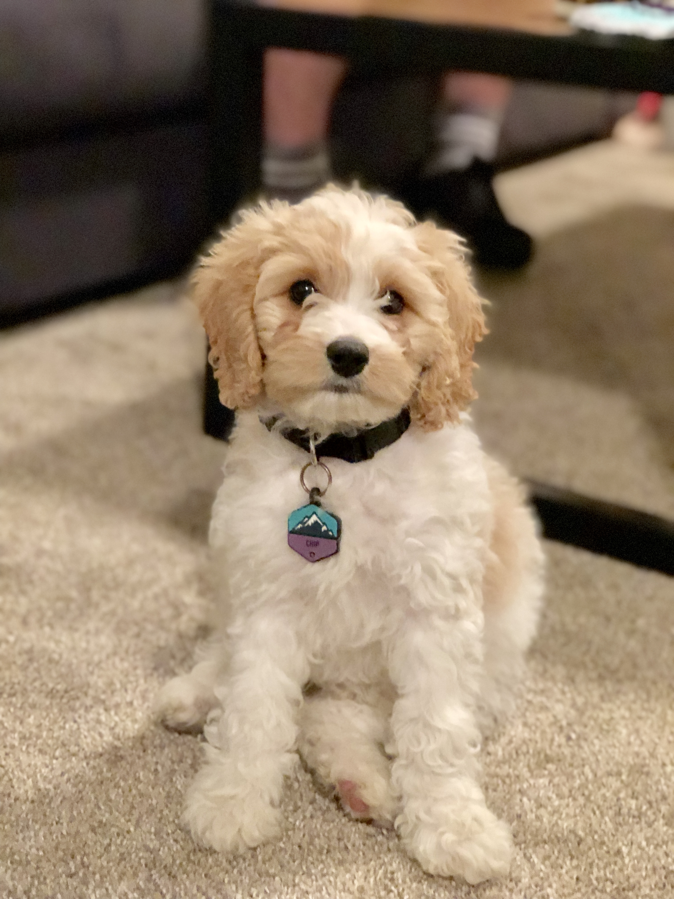
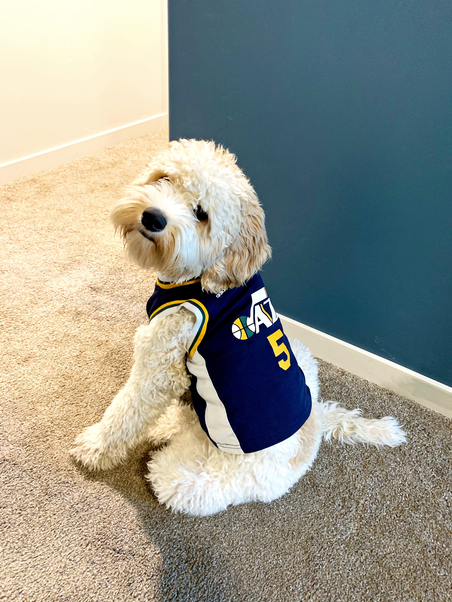

# Resume

## Experience

**CallCorp,** Lehi Utah -- _Professional Services Developer_ 
_March 2019 - Present_

* Develop specific solutions for clients on a core platform
* Develop 3rd party integrations to the core platform (Salesforce, Zoho, Zendesk)
* Develop core features on the existing platform

**Rhone Apparel,** Draper Utah -- _Web Developer_  
_April 2017 - March 2019_  

* Full stack web development on a small in-house team for an eCommerce store 
* Maintain and update website 
* Built and maintain Android mobile application 
* Develop solutions for internal needs 
* Sync custom front end, with Shopify backend

**Utah Valley University,** Orem Utah -- _Computer Science Grader_  
_August 2016 - May 2017_  
Grader/Teacher Assistant for college computer science courses.

## Education

**Utah Valley University,** Orem Utah -- _Bachelor of Science in Computer Science, emphasis in Computer Science_  
_August 2015 - May 2019_  
GPA of 3.46

**Spanish Fork High School,** -- _High School Diploma_  
_May 2013_  

## Skills

Experience with the following programming languages

* C++
* Java
* Python
* Javascript
* HTML/CSS
* PHP
* SQL

Experience with other development platforms and frameworks

* Shopify
* Android Development
* React/React Native
* Angular
* Node.js
* LAMP stack
* AWS
* GIT, Github/Bitbucket

## Interests

* Sports, especially basketball and the Utah Jazz
* Video games
* Exercise and all things active
* Programming of course -- a lot of my free time is spent learning new technologies and working on side projects for myself or for someone I know.
* My dog

